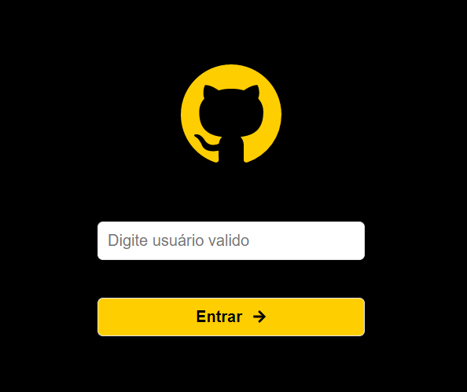
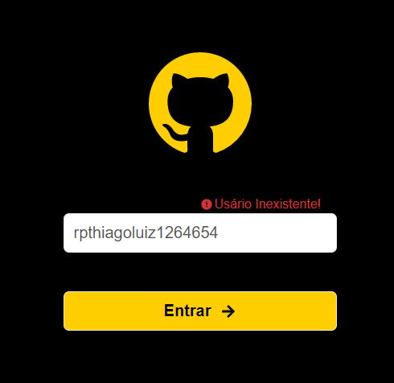
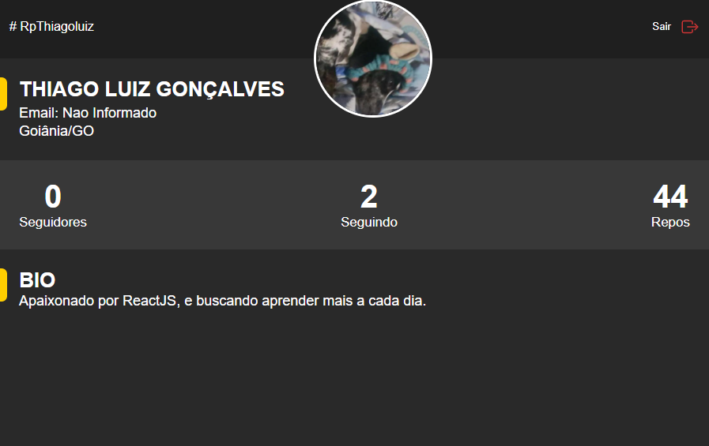
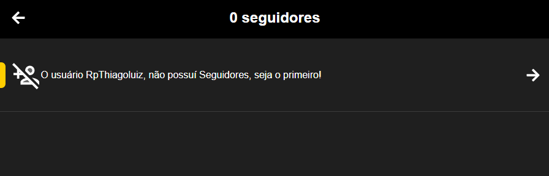
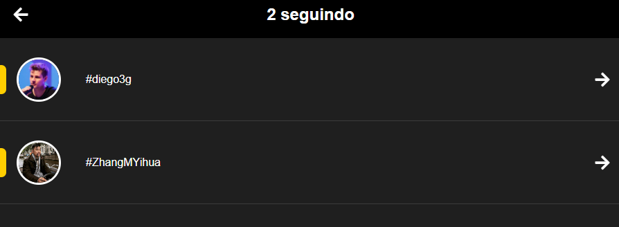

# Ly - test Frontend ReactJS

**pt-br**
 
App desenvolvido durante um teste.
O link do app esta aq [Netfly](https://ly-frontend-test-reactjs.netlify.app),ou segue as instrucoes para instalacao local.

**_Install_**

### `yarn install` ou utilizando o npm

O projeto vai rodar em [http://localhost:3000](http://localhost:3000).

**Foram Utilizados**

- Semantic Git Commits,
- Semantic Html,
- Styled Icons,
- TypeScript,
- ReactJS,
- Axios,

O call da api do GitHub tem um limite. para resolver. [403 solved!](https://docs.github.com/pt/rest/overview/resources-in-the-rest-api).

## Faltam || Precisam ser melhoradas

- [x] Curl, para eviter 403!
- [x] Style, message error. Mudar ela para um Active, quando existir o erro ele trocar o placeholder.
- [ ] Fixar o bug de troca de usuario pelo follwer e follwing.- useEffect,tem que ser passado.
- [ ] Somente logar um usuario existente dentro do github.
- [ ] Monstrar uma messagem de error caso retorne um 404.
- [ ] Monstrar outra messagem de error em um 403, com o link do github.
- [ ] Implementar um botao de salvar o usuario.

**En-us**
 
App developed during a test.
The link of the app is here [Netfly] (https://ly-frontend-test-reactjs.netlify.app), or follows according to the instructions for local installation.

**_Install_**

### `yarn install` or using npm

The project will run at [http: // localhost: 3000] (http: // localhost: 3000).

** Were used **

- Git semantic commits,
- semantic html,
- stylized icons,
- TypeScript,
- ReactJS,
- Axios,

The GitHub api call has a limit. to resolve. [403 resolved!] (Http://docs.github.com/en/rest/overview/resources-in-the-rest-api).

## Missing || Need to be improved

- [x] Curl, to avoid 403!
- [x] Style, message error. Change it to an Active, when there is an error it changes or placeholder.
- [ ] Correct the bug of switching from user to follower and following.- useEffect, has to be passed.
- [ ] Only login an existing user inside github.
- [ ] Display an error message if you return a 404.
- [ ] Show another error message on a 403, with the github link.
- [ ] Implement a button to save the user.

## Images

## Node version

v14.15.4
